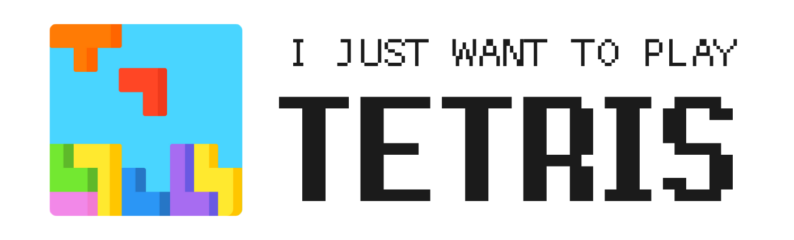
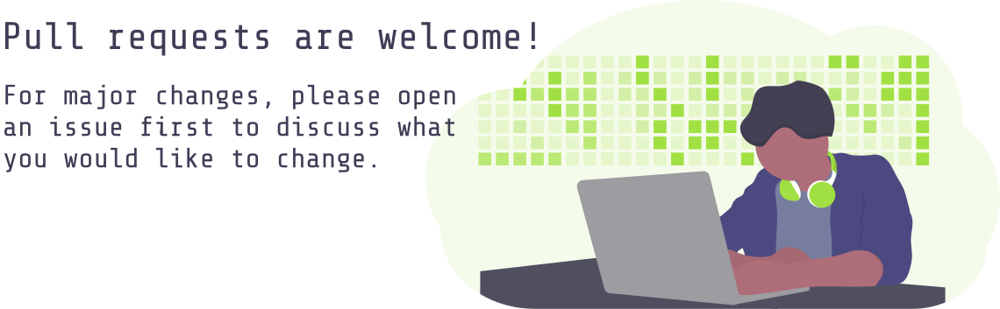

# I Just Want to Play Tetris

I just wanted to play tetris, so I decided to make my own.

### Demo

Live demo on [tetris.hericl.es](https://tetris.hericl.es)

## Project Details

Frontend developed with Vanilla JS, backend developed with Express.js

## Getting Started

To run the app, right-click the index.html file and open in a web browser (or with Live Server if using VS Code)

## Playing the Game

| Action      | Key    |
| ----------- | ------ |
| Spin Left   | x      |
| Spin Right  | &uarr; |
| Slide Left  | &larr; |
| Slide Right | &rarr; |
| Slide Down  | &darr; |
| Insta-Drop  | space  |
| Hold        | shift  |
| Pause       | p      |
| Mute Music  | m      |

## Contributing

If it is your first time contributing to this repository, please review our [contribution guidelines](https://github.com/monuelo/i-just-want-to-play-tetris/blob/master/CONTRIBUTING.md)
